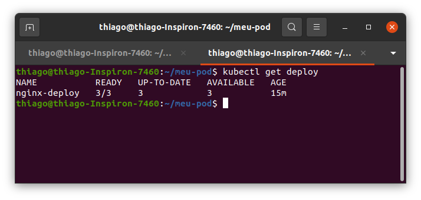
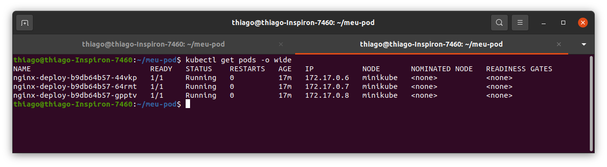
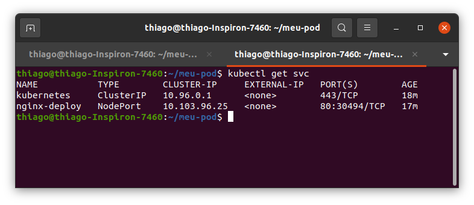
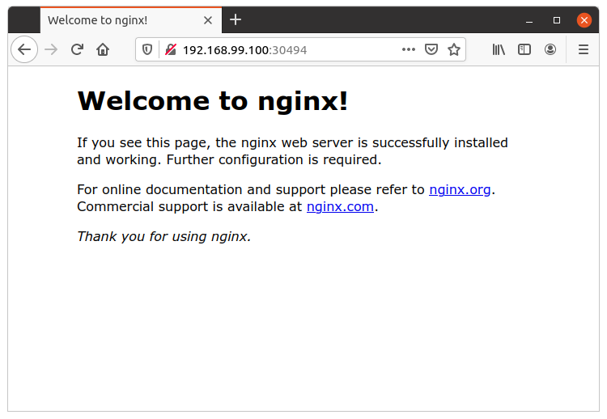

# k8s: Nginx - Deployment

O objetivo desse repositório é a criação de um Deployment que orquestre uma aplicação kubernetes. O manifesto desse deploy consiste em um deployment que cria três pods do nginx e um service que realiza o balanço de carga. As requisições ao nginx são feitas através da porta 80.

## Ambiente

Para esse projeto foi utilizado o **minikube** como ambiente de testes. Para mais informações sobre como instalar e configurar o **minikube** acesse a [documentação oficial](https://kubernetes.io/pt/docs/tutorials/hello-minikube/).

Temos dois arquivos nesse repositório:

1. nginx-pod.yaml
   1. Esse arquivo de texte apenas cria um pod com o nginx
2. nginx-deploy.yaml
   1. Esse arquivo cria um deployment com 3 pods do nginx
3. k8s.sh
   1. Esse arquivo é apenas um shell que você pode utilizar para facilitar o processo de exclusão de deployments, pods e services. Para utiliza-lo basta:

```bash
$ chmod +x k8s.sh
$ ./k8s.sh
```


## Efetuando o deploy

Para realizar o deploy dessa aplicação execute:

```bash
$ kubectl create -f nginx-deploy.yaml
```

Podemos consultar o deploy, os pods e o service criado através dos respectivos comandos:

```bash
$ kubectl get deploy
$ kubectl get pods -o wide
$ kubectl get svc
```

> Para o comando `kubectl get pods` o parâmetro `-o wide` é opicional e sua função é exibir detalhes de endereços IP's de cada POD.

O retorno deve ser algo semelhante a:



Figura 1: Retorno do Deployment



Figura 2: Retorno dos PODs



Figura 3: Retorno do Service

Nesse caso o service (type: NodePort) realiza o trabalho de receber as requisições e fazer o balanço de carga entre os PODs.

## Testando a Aplicação

Vamos verificar o IP do nosso cluster (no caso minikube) através do comando:

```bash
$ minikube ip
```

No meu caso o retorno foi: 192.168.99.100

Obser que na figura 3 o service realiza uma alteração da porta padrão do nosso nginx de 80 para 30494. Dessa maneira podemos testar o servidor através do navegador inserindo:

```
http://192.168.99.100:30494
```



Figura 4: Teste do serviço.

